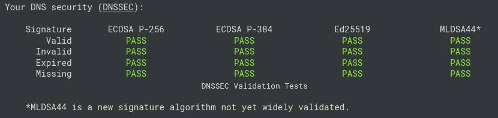

# Unified Recursive DNS Server

A high-performance, lightweight, multi-protocol recursive DNS resolver engineered in Rust. It serves plain DNS (UDP/TCP), DNS-over-TLS (DoT), and DNS-over-HTTPS (DoH) concurrently while performing independent, from-the-root iterative resolution without relying on upstream third-party resolvers (such as Google, Cloudflare, or Quad9).

Built with production-grade security, comprehensive DNSSEC validation (including authenticated denial of existence and post-quantum ML-DSA-44), anti-amplification defenses, SSRF immunity, and a stale-while-revalidate caching engine.

---

## Features & Architecture

### Multi-Protocol Transport
* **Concurrent Protocol Serving**: Simultaneously accepts plain UDP/TCP queries on port 53, DNS-over-TLS (DoT) on port 853 with ALPN `dot`, and DNS-over-HTTPS (DoH) via HTTP/1.1 and HTTP/2 on port 443 in a single runtime.
* **Reverse-Proxy Ready (DoH Offload)**: Supports unencrypted HTTP backend mode (`DOH_NO_TLS=1`) for local deployment behind reverse proxies like Nginx or Caddy, eliminating double-TLS overhead.
* **Auto-Generating Dev Certificates**: Automatically generates a self-signed development certificate on startup using `rcgen` (securing the private key with `0600` permissions on Unix) if existing PEM files are not found.
* **Unprivileged Port Fallbacks**: Automatically falls back to high ports (DNS: `5053`, DoT: `8853`, DoH: `8443`) if started without `root` privileges or `CAP_NET_BIND_SERVICE`.
* **Bounded Concurrency & Timeouts**: Governed by Tokio semaphores (2048 UDP permits, 512 TCP permits, 512 DoT permits) and strict 5-second stream timeouts to prevent file descriptor exhaustion.

### Iterative Root Recursion
* **Autonomous Resolution**: Queries authoritative nameservers iteratively starting from the 13 IANA root nameserver clusters (`a.root-servers.net` through `m.root-servers.net`).
* **Bailiwick & Referral Verification**: Strict hierarchy and bailiwick boundaries ensure out-of-bailiwick glue records cannot poison delegations or hijack ancestor zones.
* **Parallel Nameserver Racing**: Queries upstream authoritative servers in batches of 3 concurrently, taking the fastest valid response to eliminate tail latencies from unresponsive servers.
* **Automatic TCP Fallback**: Detects truncation flags (`TC=1`) from upstream authoritative servers and automatically re-queries over length-prefixed TCP.
* **Buffer Clamping (DNS Flag Day Compliance)**: Requests 1232-byte EDNS0 payload limits to avoid IP packet fragmentation over the public internet.
* **Recursion Loop Protection**: Caps resolution depth (`MAX_DEPTH = 16`) and total steps (`MAX_STEPS = 16`) with cycle detection to abort endless CNAME chains and delegation loops.
* **Glue Address Prioritization**: Prioritizes IPv4 addresses for authoritative nameservers, falling back to IPv6 glue only when IPv4 glue is unavailable.

### Cryptographic DNSSEC Engine (Classical & Post-Quantum)
* **Full Trust Chain Validation**: Walks the chain of trust from hardcoded root anchors down through DS and DNSKEY records to validate RRSIGs.
* **Current Root Anchors**: Built-in verification for root KSK-2017 (Key Tag `20326`) and root KSK-2024 (Key Tag `38696`).
* **Hybrid Verification Architecture**:
  * **Optimized Classical Engine (`ring`)**: Hardware-accelerated verification for RSA (`RSASHA256`, `RSASHA512`, 2048–8192 bits), ECDSA (`ECDSAP256SHA256`, `ECDSAP384SHA384`), and Ed25519 (`ED25519`).
  * **Native Protocol Fallback (`hickory-proto`)**: Direct delegation to Hickory's cryptographic verifier for modern and extended algorithm suites.
* **Post-Quantum Cryptography (ML-DSA-44 / Algorithm 18)**: Native validation of post-quantum lattice signatures under **NIST FIPS 204 / DNSSEC Algorithm 18**, passing validation on quantum-ready signed zones.
* **Authenticated Denial of Existence (NSEC / NSEC3)**: Negative responses (NXDOMAIN and NODATA) are only accepted after validating the denial-of-existence proof carried in the authority section. For a signed zone, a missing or malformed NSEC/NSEC3 proof is `Bogus` → `SERVFAIL`, not silently downgraded to `Insecure`. This closes the classic "forged NXDOMAIN with `AD=1`" cache-poisoning vector (same class as CVE-2010-0097).
* **NSEC/NSEC3 Signature Verification**: Every NSEC and NSEC3 RRset in a negative response must carry an RRSIG that verifies against the zone's trust-anchored DNSKEY set before the proof is considered valid. The mere presence of an NSEC/NSEC3 record is not treated as authentication.
* **Closest-Encloser Proof (RFC 5155 §8)**: For NSEC3 NXDOMAIN, the resolver derives the closest encloser, computes the next-closer name, and confirms that the received NSEC3 records cover both `H(next-closer)` and `H(*.closest-encloser)`. The closest-encloser walk is bounded to 16 steps to prevent unbounded hashing.
* **RFC 9276 NSEC3 Iteration Cap**: NSEC3 records advertising more than 150 hash iterations are rejected as `Insecure` rather than hashed, preventing an attacker-controlled signed zone from forcing expensive SHA-1 iteration work on every query.
* **Wildcard Denial Proof**: NSEC and NSEC3 negative responses must prove not only that the QNAME does not exist, but that no wildcard `*.<closest-encloser>` matches. Both proofs are required; a response supplying only one is `Bogus`.
* **RFC 4035 §5.3.4 Wildcard Synthesis**: Accurately detects and synthesizes wildcard labels before signature verification.
* **RFC 4034 §6.3 Canonical Sorting**: Reorders RRset members strictly by canonical RDATA octets prior to digest verification.
* **KeyTrap Mitigation (CVE-2023-50387)**: Enforces `MAX_SIG_CHECKS = 8` to protect against CPU exhaustion attacks from maliciously constructed DNSKEY sets.
* **Authentic Data (AD) Flag**: Injects `AD=1` into responses when all records are cryptographically verified against the chain of trust.
* **Active Tamper Blocking**: Rejects bogus, expired, forged, or unauthenticated records on signed zones with `SERVFAIL` (100% pass rate across all suites on `dnscheck.tools`).
* **Root Anchor Desync Fail-Open**: If the root anchor fails validation (e.g. an uncoordinated KSK rollover), the resolver fails open to Insecure rather than terminating resolution for the entire internet.

**Note on NSEC3 implementation.** The NSEC3 hash-ring comparison and closest-encloser proof logic are implemented in-house rather than delegated to `hickory-proto`'s validator, specifically to avoid inheriting the class of bug tracked in `hickory-proto` advisory GHSA-588m-chg6-8jqj (*"Inverted NSEC3 comparison allows forgery of proofs of nonexistence"*, affecting `0.25.0 .. 0.26.0-alpha.1`). The advisory describes an inverted wrap-around comparison in `find_covering_record()` that allows an attacker to forge negative proofs from a legitimate NSEC3 + RRSIG. Our validator does not call that code path; it computes the SHA-1 hash ring ordering directly.

### Resolver Hardening & Security
* **SSRF & Reflection Immunity**: Rejects any candidate upstream nameserver IP (from glue or resolved NS records) pointing to:
  * Private networks (RFC 1918: `10.0.0.0/8`, `172.16.0.0/12`, `192.168.0.0/16`)
  * Loopback addresses (`127.0.0.0/8`, `::1`)
  * Link-local and cloud metadata addresses (`169.254.0.0/16`, `fe80::/10`)
  * Carrier-Grade NAT (RFC 6598: `100.64.0.0/10`)
  * Documentation and benchmark ranges (RFC 2544: `198.18.0.0/15`)
  * Broadcast, multicast, unspecified (`0.0.0.0/8`, `::`)
  * IPv6 Unique Local Addresses (`fc00::/7`) and IPv4-mapped IPv6 ranges
* **Spoofed Reverse Proxy Header Protection**: Only trusts reverse-proxy headers (`CF-Connecting-IP`, `X-Real-IP`, `X-Forwarded-For`) when the incoming TCP peer is verified to be a local loopback address (`127.0.0.1` or `::1`).
* **Defense-in-Depth Socket Filtering**: Refuses to dispatch outbound UDP/TCP packets to unsafe IPs at the physical socket layer.

### Abuse Defense & Rate Limiting (RRL)
* **Subnet-Aware Token Bucket**: Aggregates traffic by `/24` IPv4 subnets and `/64` IPv6 prefixes to prevent attackers from rotating single IP addresses within a pool.
* **DNS ANY Drop**: Instantly drops UDP queries requesting type `ANY` to neutralize high-volume amplification vectors.
* **Adaptive Domain Throttling**:
  * 1st duplicate query in a one-second window: Allowed.
  * 2nd duplicate query: Challenged with `TC=1` (forces client to prove its source IP via TCP handshake).
  * 3rd+ duplicate query: Subject to a 3-second penalty drop.
* **Payload Amplification Challenges**: Forces TCP reconnection (`TC=1`) if an unauthenticated UDP response payload exceeds the client's advertised EDNS buffer.
* **Memory Protection**: Auto-prunes inactive rate-limiting buckets every 5 minutes and caps tracked domain buckets to 65,536 entries.

### Caching Engine
* **Stale-While-Revalidate**: Serves expired cached records immediately with zero client latency while asynchronously re-resolving and validating the domain in the background. A `Bogus` verdict during revalidation does **not** overwrite a previously-good cache entry, which bounds the blast radius of a transient upstream failure or a race-winning attacker.
* **Single-Flight Request Deduplication**: Uses an in-flight synchronization registry (`in_flight`) to ensure duplicate background revalidations are never triggered simultaneously for the same RRset.
* **EDNS `DO` Bit Partitioning**: Separate cache keys for `do=0` and `do=1` ensure clients requesting plain records do not receive bloated DNSSEC signatures, while validating clients retain RRSIGs.
* **Dynamic Transaction ID Rewriting**: Rewrites bytes 0 and 1 of cached wire responses on the fly to match the requesting client's query ID.
* **Delegation Caching**: Caches intermediate zone delegations (NS records and glue). Queries jump directly to the closest known ancestor rather than walking from the root on every lookup.
* **Negative & NODATA Caching**: Properly caches `NXDOMAIN` and empty `NOERROR` responses according to authority SOA TTL rules.
* **Atomic Disk Persistence**: Asynchronously syncs the in-memory cache to disk every 120 seconds and on clean shutdown using atomic file replacement (`.tmp` write followed by rename).
* **Tranco Cache Pre-warming**: Automatically downloads and unzips the Tranco Top 1M list on startup, warming the cache concurrently across A and AAAA records.

### Diagnostic & Inspection Engine (`dnscheck.rs`)
* **Real-Time Query Inspector**: Optional WebSocket watcher (`/watch/:client_id`) that streams incoming query metadata (remote IP, port, protocol, EDNS0 subnet, UDP buffer size) in real-time.
* **Deterministic Test Flags**: Supports testing flags encoded into query labels (`nullip`, `truncate`, `badsig`, `expiredsig`, `nosig`) for automated client validation and DNSSEC compliance testing.

  These flags are **test probes**, not the production security mechanism. Production DNSSEC validation rejects bad signatures on its own merit (via the RRSIG / NSEC / NSEC3 verification path), independent of the substring checks used by the diagnostic engine.

---

## Environment Variables

| Variable | Default | Description |
| :--- | :--- | :--- |
| `HOST` | `0.0.0.0` | Bind IP address for all listeners |
| `DNS_PORT` | `53` | Plain UDP/TCP DNS port (fallback: `5053`) |
| `DOT_PORT` | `853` | DNS-over-TLS port (fallback: `8853`) |
| `DOH_PORT` | `443` | DNS-over-HTTPS port (fallback: `8443`, or backend port like `3053`) |
| `DOH_NO_TLS` | `0` | Set to `1` for plain HTTP backend mode when reverse proxy terminates TLS |
| `DNSSEC_ENFORCE` | `1` | Strictly return `SERVFAIL` on broken DNSSEC chains (`0` returns data with `AD=0`) |
| `RATE_LIMIT_BURST` | `300` | Maximum token bucket burst capacity per client subnet |
| `RATE_LIMIT_PER_SEC` | `60` | Sustained refill rate per second per client subnet |
| `CERT_PATH` | `fullchain.pem` | Path to TLS certificate chain |
| `KEY_PATH` | `privkey.pem` | Path to TLS private key |
| `WARM_LIMIT` | `0` | Number of top Tranco domains to pre-warm on launch (`0` to disable) |
| `WARM_CONCURRENCY` | `6` | Concurrency limit for background pre-warming |

---

## Building and Compiling

Ensure Rust (1.78 or newer) and Cargo are installed.

### 1. Compile Binary

```bash
cargo build --release
```

The compiled binary will be placed at `./target/release/doh-server`.

### 2. Granting Privileged Port Permissions (Recommended)

To run the binary as an unprivileged service user while still binding to low-numbered privileged ports (53, 443, 853):

```bash
sudo setcap 'cap_net_bind_service=+ep' ./target/release/doh-server
```

---

## Deployment Architectures

### Option A: Standalone Deployment (Direct TLS)

In this configuration, the server directly manages all TLS operations for DoH and DoT using Let's Encrypt certificates.

Create `/etc/systemd/system/doh-server.service`:

```ini
[Unit]
Description=Unified Recursive DNS Server
After=network.target

[Service]
Type=simple
User=doh
Group=doh
WorkingDirectory=/var/lib/doh-server
ExecStart=/usr/local/bin/doh-server

Environment="HOST=0.0.0.0"
Environment="DNS_PORT=53"
Environment="DOT_PORT=853"
Environment="DOH_PORT=443"
Environment="DOH_NO_TLS=0"
Environment="DNSSEC_ENFORCE=1"
Environment="RATE_LIMIT_BURST=300"
Environment="RATE_LIMIT_PER_SEC=60"
Environment="CERT_PATH=/etc/letsencrypt/live/dns.example.com/fullchain.pem"
Environment="KEY_PATH=/etc/letsencrypt/live/dns.example.com/privkey.pem"
Environment="WARM_LIMIT=500"
Environment="WARM_CONCURRENCY=8"
Environment="RUST_LOG=info,doh_server=info"

Restart=always
RestartSec=3
LimitNOFILE=65535

[Install]
WantedBy=multi-user.target
```

Start the daemon:

```bash
sudo systemctl daemon-reload
sudo systemctl enable --now doh-server.service
```

---

### Option B: Reverse Proxy Deployment (Nginx + DoH Backend)

In this architecture, Nginx handles public HTTPS traffic (port 443) and proxies DoH requests to `127.0.0.1:3053` using `DOH_NO_TLS=1`. Plain DNS and DoT continue to run directly on ports 53 and 853.

#### 1. Systemd Service Configuration

```ini
[Unit]
Description=Unified Recursive DNS Server (Backend Mode)
After=network.target

[Service]
Type=simple
User=doh
Group=doh
WorkingDirectory=/var/lib/doh-server
ExecStart=/usr/local/bin/doh-server

Environment="HOST=0.0.0.0"
Environment="DNS_PORT=53"
Environment="DOT_PORT=853"
Environment="DOH_PORT=3053"
Environment="DOH_NO_TLS=1"
Environment="DNSSEC_ENFORCE=1"
Environment="CERT_PATH=/etc/letsencrypt/live/dns.example.com/fullchain.pem"
Environment="KEY_PATH=/etc/letsencrypt/live/dns.example.com/privkey.pem"
Environment="RUST_LOG=info,doh_server=info"

Restart=always
RestartSec=3
LimitNOFILE=65535

[Install]
WantedBy=multi-user.target
```

#### 2. Nginx Site Configuration

```nginx
upstream doh_backend {
    server 127.0.0.1:3053;
    keepalive 64;
}

server {
    listen 80;
    listen [::]:80;
    server_name dns.example.com;

    location /.well-known/acme-challenge/ {
        root /var/www/html;
    }

    location / {
        return 301 https://$host$request_uri;
    }
}

server {
    listen 443 ssl http2;
    listen [::]:443 ssl http2;
    server_name dns.example.com;

    ssl_certificate /etc/letsencrypt/live/dns.example.com/fullchain.pem;
    ssl_certificate_key /etc/letsencrypt/live/dns.example.com/privkey.pem;

    ssl_protocols TLSv1.2 TLSv1.3;
    ssl_ciphers HIGH:!aNULL:!MD5;
    ssl_session_cache shared:DOH_SSL:20m;
    ssl_session_timeout 1d;

    client_max_body_size 10k;

    # RFC 8484 DoH query endpoint
    location = /dns-query {
        proxy_pass http://doh_backend/dns-query;
        proxy_http_version 1.1;

        proxy_set_header Connection "";
        proxy_set_header Host $host;
        proxy_set_header X-Real-IP $remote_addr;
        proxy_set_header X-Forwarded-For $proxy_add_x_forwarded_for;
        proxy_set_header Content-Type application/dns-message;

        proxy_buffering off;
        proxy_request_buffering off;
    }

    # Health monitoring endpoint
    location = /health {
        proxy_pass http://doh_backend/health;
        proxy_set_header Host $host;
    }
}
```

---

## Verification & Testing

### 1. Plain DNS (UDP & TCP)

Test standard UDP resolution:

```bash
dig @127.0.0.1 -p 53 example.com A +dnssec
```

Test TCP fallback and functionality:

```bash
dig +tcp @127.0.0.1 -p 53 example.com A +dnssec
```

### 2. DNS-over-TLS (DoT)

Verify encrypted TLS DNS resolution using `kdig`:

```bash
kdig -d @dns.example.com:853 +tls example.com A
```

### 3. DNS-over-HTTPS (DoH)

Check system health and active cache size:

```bash
curl -s https://dns.example.com/health
```

Execute a wireformat query via HTTP POST:

```bash
# Base64-encoded query for example.com IN A
echo -n "AAABAAABAAAAAAAAA3d3dwdleGFtcGxlA2NvbQAAAQAB" | base64 -d | \
  curl -s -X POST --data-binary @- \
  -H "Content-Type: application/dns-message" \
  -H "Accept: application/dns-message" \
  https://dns.example.com/dns-query | hexdump -C
```

Execute a query via HTTP GET (RFC 8484):

```bash
curl -s -H "Accept: application/dns-message" \
  "https://dns.example.com/dns-query?dns=AAABAAABAAAAAAAAA3d3dwdleGFtcGxlA2NvbQAAAQAB" | hexdump -C
```

### 4. Comprehensive DNSSEC Validation Testing

The resolver achieves a **100% pass rate across all test suites** on [dnscheck.tools](https://dnscheck.tools/), validating classical curves, negative proof handling, and cutting-edge post-quantum algorithms:



* **ECDSA P-256 (alg13)**: Resolves successfully with `AD=1`.
* **ECDSA P-384 (alg14)**: Resolves successfully with `AD=1`.
* **Ed25519 (alg15)**: Resolves successfully with `AD=1`.
* **MLDSA44 (alg18)**: Post-quantum signatures resolve successfully with `AD=1`.
* **Invalid / Bad Signature (`badsig`)**: Resolution strictly blocked with `SERVFAIL`.
* **Expired Signature (`expiredsig`)**: Expired time-bounds strictly blocked with `SERVFAIL`.
* **Missing Signature (`nosig`)**: Unsigned records on signed zones strictly blocked with `SERVFAIL`.

### 5. Negative-Answer (NSEC / NSEC3) Validation

The resolver validates denial-of-existence proofs rather than trusting the mere presence of an NSEC/NSEC3 record:

```bash
# Signed zone, NXDOMAIN — expect AD=1 and NSEC/NSEC3 records in the authority section
dig +dnssec @127.0.0.1 -p 53 nonexistent.cloudflare.com A

# Signed zone, NODATA — expect AD=1
dig +dnssec @127.0.0.1 -p 53 cloudflare.com AAAA

# Unsigned zone, NXDOMAIN — expect AD=0 and an SOA, no NSEC
dig +dnssec @127.0.0.1 -p 53 nonexistent.example.com A

# Deep NSEC3 hierarchy — expect AD=1 (exercises the closest-encloser walk)
dig +dnssec @127.0.0.1 -p 53 a.b.c.nonexistent.cloudflare.com A
```

To confirm the fix is load-bearing, strip the NSEC/NSEC3 records from a signed zone's negative response (e.g. with a local authoritative server or `scapy`) and re-query. The resolver should now return `SERVFAIL` instead of caching an `AD=0` NXDOMAIN.

---

## Security Mitigations Matrix

| Threat Vector | Mitigation Strategy | RFC / CVE Reference |
| :--- | :--- | :--- |
| **SSRF / Reflection via Glue** | Strict rejection of private, loopback, multicast, link-local, and cloud metadata IPs from glue and resolved NS addresses | RFC 1918, RFC 3927, RFC 6598 |
| **DNS Cache Poisoning** | Bailiwick checks, random transaction IDs, randomized server selection, and response query matching | RFC 5452 |
| **Forged NXDOMAIN / Negative-Answer Poisoning** | NSEC and NSEC3 denial-of-existence proofs are validated against the zone's trust-anchored DNSKEYs before a negative response is accepted or cached. Missing or invalid proofs on signed zones return `SERVFAIL`. Closest-encloser and wildcard proofs are both required; NSEC3 iteration counts are capped per RFC 9276. | RFC 4035 §5.4, RFC 5155 §8, RFC 9276, CVE-2010-0097, CVE-2020-12244 |
| **DNS Amplification** | Instant drop of UDP `ANY` queries; truncated challenges (`TC=1`) when response size exceeds EDNS payload | RFC 8482 |
| **Volumetric / DoS Floods** | Subnet-aggregated token bucket rate limiting (/24 IPv4, /64 IPv6) with progressive backoff | RFC 5358 |
| **KeyTrap Algorithmic Complexity** | Signature verification attempts capped to 8 per lookup; NSEC3 iteration counts capped to 150 | CVE-2023-50387 |
| **NSEC3 Hash-Ring Forgery** | In-house NSEC3 hash-ring comparison and closest-encloser proof logic, avoiding an upstream advisory in `hickory-proto` 0.25.0..0.26.0-alpha.1 | GHSA-588m-chg6-8jqj |
| **DNS Wildcard Forgery** | Pre-verification label count calculation and wildcard synthesis; wildcard non-existence proven on every NSEC/NSEC3 negative response | RFC 4035 §5.3.4 |
| **Proxy Header Spoofing** | Proxy headers (`X-Real-IP`, `X-Forwarded-For`) only evaluated when incoming connection is from loopback | Security Best Practice |
| **Fragmented UDP Poisoning** | Outgoing EDNS buffer clamped to 1232 bytes to eliminate IP fragmentation | DNS Flag Day 2020 |

---

## License

This project is licensed under the MIT License.